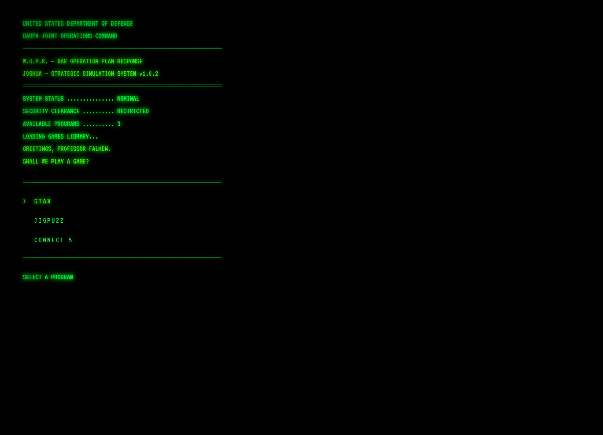

# WarGames WOPR Game Menu

A WarGames-themed game directory hosted at https://esdavis.dev/games

## Features

- Phosphor-green CRT terminal aesthetic (VT323 font, scanlines, screen flicker)
- Typewriter boot sequence
- "Greetings, Professor Falken" audio greeting
- Per-keystroke Web Audio click sound
- Keyboard, mouse, and touch navigation
- Mobile-responsive
- Auto-starts on page load — no tap/click required to begin
- Note: Audio may be muted by browser autoplay policy (since there is no longer a user gesture before audio plays)

## Screenshot



## File Structure

```
game-menu/
├── index.html
├── favicon.svg
├── css/
│   └── style.css
├── js/
│   └── main.js
└── audio/
    ├── greetings.mp3
    └── shall-we-play.mp3
```

## Deployment

The site deploys automatically via GitHub Actions when a GitHub release is published. The release tag is stamped into the `VERSION` constant in `js/main.js` via `sed`.

**Server Path:** `/var/www/esdavis.dev/games`

**Required Secrets:**
- `DEPLOY_HOST`
- `DEPLOY_USER`
- `DEPLOY_KEY`

## Games

| Name | URL |
| --- | --- |
| STAX | https://esdavis.dev/stax |
| JigPuzz | https://esdavis.dev/jigpuzz |
| Connect 5 | https://esdavis.dev/connect5 |

To add or change games, update the `GAMES` constant at the top of `js/main.js`.

## Navigation

| Input | Action |
| --- | --- |
| Keyboard | ↑↓ arrows to move, Enter to launch |
| Mouse | Hover to highlight, click to launch |
| Touch | Tap to launch |
